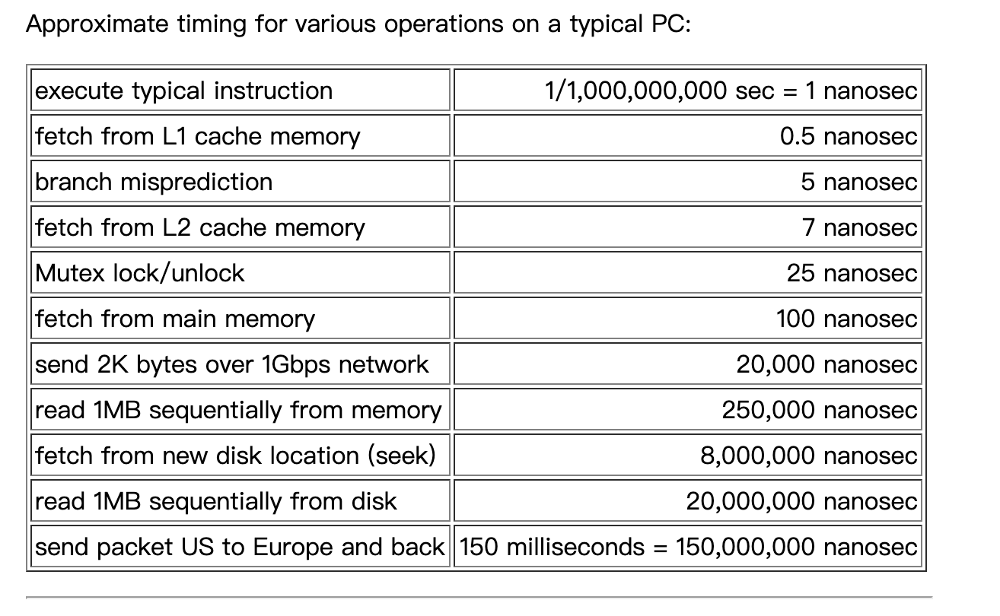

# Teach Yourself Programming in Ten Years

## 原文：
来自Peter Norvig 的blog中的文章 [Teach Yourself Programming in Ten Years](http://norvig.com/21-days.html)

## 文章摘抄、总结

1. 文章对市面上充斥的各种类似于<Teach Yourself Java in 24 Hours（24小时自学Java）>等书籍的现象进行了批判，为什么：表面熟悉，实际上不够深入，不知道这门语言的优势所在。

2. 十年，10000小时（Malcolm Gladwell）
    - 成为一方面的专家并不只是单纯的重复去做，而是一个不断迭代的过程：挑战，尝试，分析反馈，改进，重复。
    The key is deliberative practice: not just doing it again and again, but challenging yourself with a task that is just beyond your current ability, trying it, analyzing your performance while and after doing it, and correcting any mistakes. Then repeat. And repeat again. There appear to be no real shortcuts。

3. 建议：
    1. 兴趣
    2. 动手编码 "the most effective learning requires a well-defined task with an appropriate difficulty level for the particular individual, informative feedback, and opportunities for repetition and corrections of errors."
    3. 与其他程序员交流，阅读别人的代码
    4. 投入四年时间上大学（more 研究生）
    5. 和其他程序员一起工作。Be the best programmer on some projects; be the worst on some others. 前者验证你带领一个项目的能力，以及用你的视野去激励他人；后者，学习专家们怎么做的，以及他们不喜欢做的
    6. 维护他人的项目
    7. 至少学习6门（a half dozen）编程语言：面向对象的如Java or C++；函数式如 Lisp or ML or Haskell；支持语法抽象的如Lisp；支持declarative specifications的如Prolog or C++ templates；突出并发的如Clojure or Go
    8. 知道计算机中各类操作的耗时
    
    9. 参与语言标准化工作（Get involved in a language standardization effort）
    10. 具有尽快脱身语言标准化工作的良好判断力

4. 如果选择一种编程语言
    1. 问你的朋友，以及考虑未来的朋友及社区
    2. 选择简单的
    3. 交互式学习（interactive mode），玩中学

    综上，推荐Python或者Scheme。

5. Bad programming is easy. Idiots can learn it in 21 days, even if they are dummies.

6.  Alan Perlis once said: "A language that doesn't affect the way you think about programming, is not worth knowing".

## 个人输出：

## 单词、短语、句式：
1. fabulously：及其
    - The conclusion is that either people are in a big rush to learn about programming, or that programming is somehow fabulously easier to learn than anything else. 

2. superficial familiarity： 表面的熟悉
    - So the book can only be talking about a superficial familiarity, not a deep understanding. As Alexander Pope said, a little learning is a dangerous thing.

3. "Life is short, craft long, opportunity fleeting, experiment treacherous, judgment difficult." 

4. "anyone can cook, but only the fearless can be great."
