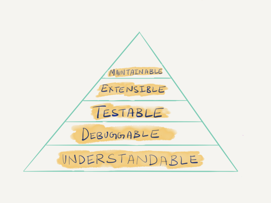

# Effective Mental Models for Code and Systems
# 代码和系统的有效思维模型

## 原文：
来自Medium [Effective Mental Models for Code and Systems](https://medium.com/@copyconstruct/effective-mental-models-for-code-and-systems-7c55918f1b3e)

## 文章摘抄、总结
1. A mental model is an explanation of someone’s thought process about how something works in the real world. It is a representation of the surrounding world, the relationships between its various parts and a person’s intuitive perception about his or her own acts and their consequences.

2. guideline
    1. Optimize for Understandability
    Hierarchy of needs for code and systems
    
    2. Identify all the different target audience

    3. Self-documenting code is a myth
    4. Comments are easier to parse than code
    5. A Case for Better Composition of Layers
    6. Each layer should encapsulate an “Error Kernel”
    - In his talk The Do’s and Don’ts of Error Handling, Joe Armstrong posits that “large assemblies of small things are impossible to prove correct”, and that when it comes to large systems, it becomes important to be able to identify and isolate the error kernel of a system.

    7. Do not omit details owing to “shared understanding”
    8. Make implicit assumptions and dependencies explicit
    9. Concrete is better than Abstract
    10. Validation to Compare, Contrast and Recalibrate Mental Models

## 个人输出：
1.

## 单词、短语、句式：
1. pair programming
2. subscribe to this school of thought 赞成这个思想流派
3. rinse and repeat 重复
4. doom and gloom 厄运与黑暗，绝望与沮丧
- The report on our economic situation is full of doom and gloom. 这份关于我们经济状况的报告，充满了令人绝望和沮丧的调子。
5. recalibrate 重新校准
6. cater to a different target audience 迎合不同的目标受众
- A single codebase may consist of multiple components (libraries, binaries, configuration files and so forth) each of which might cater to a different target audience. 
7. As often as not 往往，经常
8. happy path
9. the pros and cons 利弊

## 相关阅读：

[The Relativity of Wrong (By Isaac Asimov)](https://chem.tufts.edu/answersinscience/relativityofwrong.htm)