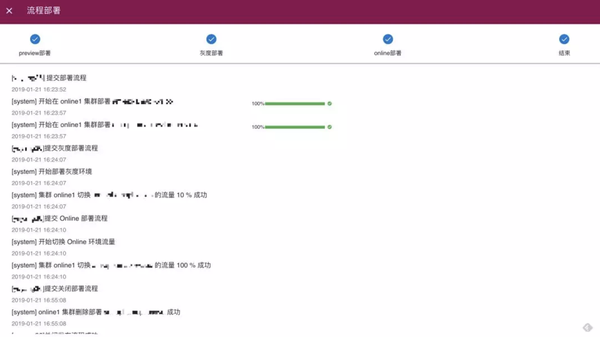
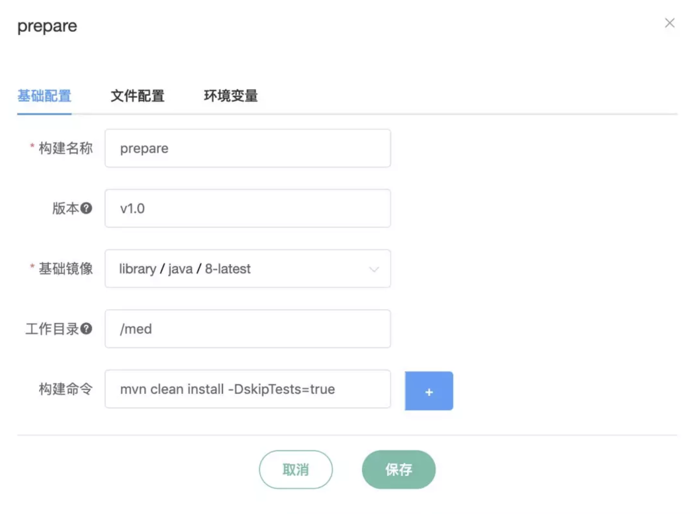

# 分享：瓜子云平台的实践经验

这篇是瓜子同事高永超(Flex，现在是负责运维部门的技术总监) 发表在 Docker 微信公众号号上的一篇文章，原文：[瓜子云平台的实践经验](https://mp.weixin.qq.com/s/tmOp_Sbi9mopUNDTxp4Mew)，文章对瓜子云平台从0到1的搭建过程的技术选型、具体实践等写得很详细，在此分享给大家。

以下是全文：

# 
 瓜子云平台的实践经验 

私有云平台的建设和公司在不同阶段的需求是息息相关的，瓜子云平台从 2017 年启动项目，到目前承载了公司上千个应用服务，每月服务发布次数达上万次。在公司业务爆发性增长的背景下，云平台团队从 0 到 1 的完成了平台搭建，初步实现了平台产品化，也总结出了一些云平台建设的实践和经验。

这篇文章和大家分享下瓜子云平台的一些实践经验。瓜子是在 2017 年年中启动云平台项目的，当时有如下背景：

- 技术栈多样化，PHP、Java、Go、Python 都有使用，但只有 PHP 建立了相对统一的部署流程

- 业务迭代速度快，人员扩张速度快，再加上微服务化改造，项目数量激增，基于虚拟机的运维压力很大

- 测试环境没有统一管理，业务开发人员自行零散维护

基于此，我们的 0.x 版本，也是原型版本选择了如下的切入点：

- 在 CI/CD 层面，先定义出标准流程，但是并不涉及细节的规范化，便于用户学习，快速将现有流程套进去

- 同时支持 image 和 tar 包两种产出，为云上部署和虚拟机部署做好构建路径的兼容，在将来迁移时这部分可以做到几乎无缝

- 先支持测试环境的部署，在验证平台稳定性的同时，不断收集用户需求进行快速迭代

## 
<u>集群核心组件的技术选型</u>

在服务编排和资源管理方面，Docker 和 Kubernetes 已经比较成熟了，基于容器的微服务化也是大势，再加上我们对强隔离没有诉求，所以跳过了 OpenStack，直接选择了 Kubernetes 方案。

既然用了 Kubernetes 肯定就要解决跨节点的容器网络通信问题，因为我们是自建机房，没有公有云在网络层面的限制，所以没有考虑应用范围更广但是性能和可调试性较差的 VXLAN 方案。最开始选择的是 Macvlan + 自研 IPAM 的方式，之后转向了方案完成度更高的基于 BGP 协议的 Project Calico。

Calico 的优点如下：

- 基于 BGP 协议，转发平面依靠主机路由表，不涉及任何封包解包操作，性能非常接近原生网卡，并且方便抓包调试

- 组件结构简单，对 Kubernetes 支持很好

- 可以和 IDC 路由器通过 BGP 协议打通，直接对外广播容器 IP，让集群内外可以通过 IP 直连

- 有 ACL 能力，类似 AWS 的 Security Group

当然肯定有缺点：

- 节点间网络最好是二层可达，否则只能使用 IP-in-IP 这种隧道技术，那就失去大半意义了

- 因为是基于三层转发的，无法做到二层隔离，安全诉求高的场景不适用

- 严重依赖 iptables，海量并发情况下 netfilter 本身可能成为瓶颈

编排和网络解决后，集群就可以拉起来，接下来需要考虑的是流量如何进入，也就是负载均衡器的选型。在不想过多自己开发的前提下，使用 Kubernetes Ingress 是一个比较好的选择，但是不同 Ingress 之间功能和成熟度差异都很大，我们也是尝试了好几种，从 Nginx 到 Linkerd，最终选择了 Istio。我们在 0.2 版本开始用 Istio，初期它的不稳定带来了很多困扰，不过在 1.x 版本发布后相对稳定很多了。选择 Istio 的另一个原因是为将来向 Service Mesh 方向演进积累经验。

以上一个最小功能可用集群就基本完备了，接下来在 CI/CD 这块，我们封装了一个命令行工具 med，它通过读取项目中的 med.yml，自动生成 dockerfile 和 deployment.yml，之后调用 Docker 进行构建，并提交给 Kubernetes 集群进行部署。

一个 med.yml 例子如下：

从上面这个例子能看到，我们将构建环节拆分成了 prepare 和 build 两个部分，这个设计其实来源于 dockerfile 的一个最佳实践：由于拉取依赖的环节往往较慢，所以我们习惯将依赖安装和编译过程放到不同的命令中，形成不同的 layer，便于下次复用，提高编译速度。prepare 阶段就是把这部分耗时但是变更不频繁的操作提出来，通过 version 字段控制，只要 version 值不变，prepare 部分就不会再重复执行，而是直接利用之前已经生成好的 prepare 镜像进行接下来的 build 环节。build 环节构建结束后将 image 提交到镜像仓库，等待用户调用 deploy 命令进行部署。

在实际开发过程中用户提出同一个代码仓库构建多个产出的需求，比如一个 Java 项目同时构建出用于发布的 Web Service 和提交到 Maven 的 jar 包。所以 build 和 deploy 阶段都支持多个产出，通过 name 进行区分，参数方面则支持有限的模板变量替换。

最后，我们将 med.yml 和 GitLab CI 结合，一个 CI/CD 流程就出来了，用户提交代码后自动触发构建，上传镜像并部署到他的测试环境。

## 
<u>云平台产品化的一些思考</u>

### 云平台 1.x

在测试环境跑了一段时间后，大家纷纷尝到了甜头，希望不只是在测试环境使用，生产环境也可以部署。这时简易的客户端工具就不满足需求了，新增的主要诉求围绕着权限管理和灰度发布，同时也希望有一个更加可视化的平台能看到实例运行的状态，上线的进度和监控日志等。需求细化如下：

- 能直观看到当前项目的运行状态，部署状态
- 项目有权限控制
- 发布系统支持预发布和灰度部署
- 日志收集和监控报警能力
- 配置管理能力
- 定时任务支持

于是经过几轮迭代后，可视化的控制台上线了：

这里可以详细展开下部署环节，为了满足应用上线时的小流量测试需求，最开始是通过用户换个名字手工部署一个新版本，然后灵活调整不同版本部署之间的流量百分比来实现。但是在运行一段时间后，发现太高的灵活度调整非常容易出错，比如忘记了一个小流量部署，导致线上不正常，还很难 debug，并且整个操作过程也很繁琐。于是我们收敛了功能，实现了流程发布功能：

无论是流量调整还是流程发布，Kubernetes 默认的滚动更新都是无法满足需求的。我们是通过先创建一组新版本实例，然后再变更 Istio 的流量切换规则来实现的，示意图如下：

同时为了既有项目平滑上云，我们还提供了容器和虚拟机部署的联合部署，支持一个项目在一个发布流程中同时部署到云平台和虚拟机上。再配合外部 Nginx 权重的跳转，就可以实现业务逐步将流量切换到云上，最终完全去掉虚拟机。

这里有一个小插曲，由于基于 TCP 的 Dubbo 服务流量不经过 Istio 网关，而是通过注册到 ZooKeeper 里面的 IP 来进行流量调整的，上面的流程发布和联合部署对 Dubbo 服务没有意义。我们在这个版本进行了一个网络调整，将集群内部的 BGP 路由和外部打通，允许容器和虚拟机直接通信。由于 Calico 更换网段是要重新创建所有容器的，所以我们选择拉起一个新集群，将所有应用全部迁移过去，切换流量入口，再下掉旧集群。这里就体现了容器的便捷性了，数百个应用的迁移只花了十几分钟就再另一个集群完全拉起，业务几乎没有感知。

配置管理方面，最开始是通过 env 管理，后来很多应用不太方便改成读取 env 的方式，又增加了基于 ConfigMap 和配置中心的配置文件注入能力。

日志收集方面，最开始使用 ELK，只收集了容器的 stdout 和 stderr 输出，后来对于放在指定位置的文件日志也纳入了收集目标中。由于 Logstash 实在太耗资源，我们直接使用 ES 的 ingest 能力进行日志格式化，去掉了中间的 Kafka 和 Logstash，从 Filebeat 直接输出到 ES。当然 ingest pipeline 本身调试起来比较复杂，如果有较多的日志二次处理需求，不建议使用。日志展示方面，Kibana 原生的日志搜索能力已经比较强大，不过很多人还是喜欢类似 tail -f 的那种查看方法，我们使用了 Kibana 的第三方插件 Logtrail 进行了模拟，提供了一键从控制台跳转到对应容器日志查看界面的能力。

监控收集和展示，也是标准的 Prometheus + Grafana，在收集 Kubernetes 暴露出来的性能指标的同时，也允许用户配置自定义监控的 metric url，应用上线后会自动抓取。报警方面，因为 Prometheus 自带的 Alert Manager 规则配置门槛比较高，所以我们开发了一个用于规则配置的项目 NieR，将常用规则由运维同学写好后模板化，然后再提供给用户订阅，当然用户也可以自行建立自己的模板。监控报警系统展开说能再写一篇文章了，这里就只放一下架构图：

### 云平台 2.x

在 1.x 版本迭代的时候，我们发现，早期为了给用户最大灵活性的 med.yml 在用户量持续增长后带来的培训、运维成本越来越高。每一个第一次接触平台的同事都要花费半天的时间阅读文档，然后在后续的使用中还有很多文档没有描述清楚的地方要搞明白，变相提高了项目上云的门槛。另外这种侵入用户代码仓库的方式，每次调整代价都非常大，服务端控制力度也太弱。

针对上述问题，我们在 2.x 版本彻底去掉了 med.yml，实现了全部 UI 化。这里并不是说把之前的配置文件丢到一个管理页面上就算搞定了。拿构建来说，用户希望的是每种语言有一个标准的构建流程，只需要稍微修改下构建命令就可以直接使用，于是我们定义了语言模板：

然后替用户填好了大部分可以规范化的选项，当然也允许用户自行编辑：

在部署层面，除了和构建产出联动外，最大的变动是参数合理化布局，让新用户基本不用看文档就能明白各个参数的用途。

2.x 版本才刚刚起步，后续还有非常多在排期安排的事情，比如在功能方面：

- 支持多集群部署之后如何做到跨集群调度
- 如何方便的能让用户快速拉起一套测试环境，乃至于构建自己的内部应用市场
- 监控系统能不能进一步抽象，直接通过 UI 的方式配置监控模板，能不能自动建议用户合理的监控阈值
- 给出各个业务的资源利用率和账单

在基础设施层面：

- 能不能做到不超售但是还能达成合理的资源利用率
- 离线计算能不能在低峰期复用在线集群资源，但是不能影响业务
- ServiceMesh 的进一步研究推广
- 有状态服务的支持等等

等等

以上就是瓜子云平台的整体迭代路径。在整个开发过程中，我们感触最深的一点是，需要始终以产品化而不是做工具的思想去设计和实现。技术是为了需求服务的，而不是反过来，把一个用户最痛的痛点打透比做一百个酷炫的功能有用的多。但打透说起来容易，做起来有很多脏活累活。

首先在需求分析阶段，基础设施的变更影响非常广泛，在征求大部分人意见的同时，如何引导大家往业界内更先进的路线上演进是要经过深思熟虑的。另外不同阶段的需求也不尽相同，不要一窝蜂的追随技术潮流，适合当前阶段的才是最好的技术选型。

其次切入点最好是选择共识基础好，影响范围大的需求点，阻力小，成果明显。待做出成果后再一步步扩展到分歧比较严重的深水区。

最后落地的时候要做好技术运营，做好上线前的宣传培训，帮助用户从旧系统尽量无痛的进行迁移。上线后的持续跟踪，通过数据化的手段，比如前端埋点，核心指标报表等手段观察用户的使用情况，不断调整策略。

上面这些在团队小的时候可能都不是问题，一个沟通群里直接就能聊清楚。但当团队变大后，核心功能上一个不当的设计往往带来的就是上千工时的白白消耗甚至造成线上事故，一个云平台产品能不能落地，技术架构和实现是一方面，上面这些产品和运营策略是否运用得当也是非常重要的。

## 
<u>Q&A</u>

**Q：请问瓜子私有云是一朵独立的云还是多云部署？如果是多云部署，云间网络是采用的什么技术？如何打通多云之间的网络的？谢谢**

A：我们在设计之初就考虑多集群 / 多 IDC 部署的，这也是选择 Calico 的一个原因。通过 BGP 协议将容器 IP 广播出去后，云间互联和普通虚拟机互联没有区别，当然这需要网络设备支持。

**Q：新版本实例发布的时候怎么切Istio才能保障灰度的流量不丢失呢？**

A：在流程发布里面，我们相当于先新建一组新的实例，在它们的 Readiness 检查通过后，切换 Istio 规则指向新实例做到的。

**Q：稳定性方面有没有出现过比较大的问题，怎么解决的？**

A：有两个时期稳定性故障较多，一个是 Istio 版本比较低的时候，这个只能说一路趟坑趟过来，我们甚至自己改过 Istio 代码，现在的版本已经没出过问题了；一个是集群用的太狠，当集群接近满载时，Kubernetes 会出现很多连锁问题，这个主要是靠监控来做及时扩容。

**Q：自建机房的话为什么不接着使用 Macvlan + IPAM 方案呢？是为了之后上公有云做准备吗？**

A：当时面临一个本机 Macvlan 容器互相不通的问题，再加上有熟悉的团队已经在生产跑了很久 Calico 了，所以就直接换到了 Calico。

**Q：请问几秒的时延对一些高效的服务来讲也是不可接受的。咱们有想过通过何种方式去避免灰度的流量损失问题么？**

A：还真没遇到过这个需求。我理解如果有一个服务如此关键，那么在整个流量变更环节（从机房入口开始）到灰度策略上都得仔细考虑。如果接受不了 Istio 这个延时，一个思路是完全抛弃 Istio Ingress，直接使用一个切换迅速的负载均衡器。因为容器 IP 是直通的，完全可以从集群外直接连进来，只要解决服务发现的问题就行。

**Q：应用服务追踪怎么处理的？对接Istio？**

A：语言栈比较多的情况下这是个痛点，目前我们也是在尝试，即使是 Sidecar 也不能完全对业务没侵入。公司内部 Java 技术栈更喜欢 Skywalking 这种完全无侵入的方式。

**Q：使用 Istio 时，怎么解决性能损坏问题的？**
A：目前还没有启用 Mixer 这些对性能影响比较大的组件，所以目前性能损耗还是比较小的。如果对性能有严格的要求，我们会建议他使用 service name 做直连。

**Q：为什么 Kubernetes 默认的滚动更新不能满足要求？哪里有问题？**

A：没办法精细控制灰度粒度，比如部署了 4 个实例，我要求切 10% 的流量灰度，这就做不到了。另外，滚动更新回滚也比较慢。

**Q：目前支撑的生产应用服务规模和云平台的规模能介绍下？包括一些指标，比如多少应用进行灰度更新耗时？**

A：应用规模的话目前超过 1000 了，每个月发布次数超过 10000。灰度更新是用户自行控制整个发布进度的，所以耗时不太有参考意义。

