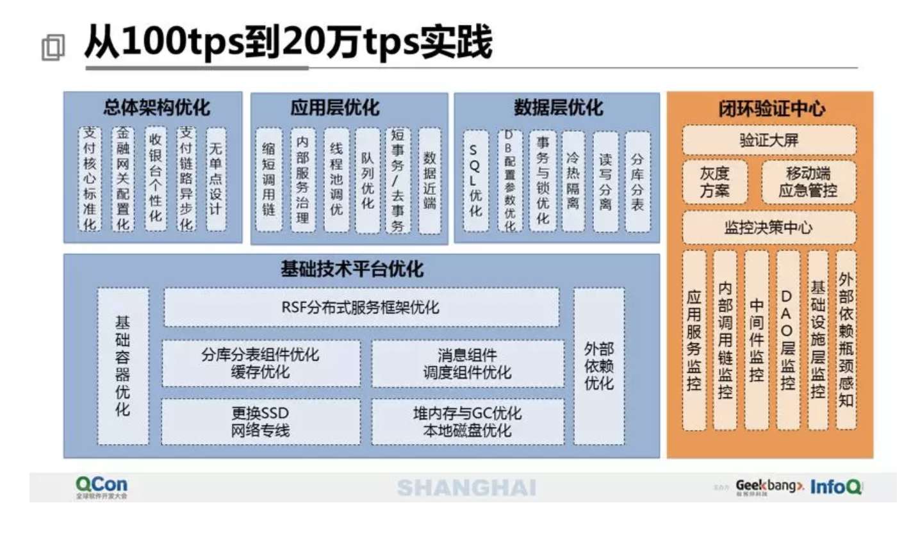

# 分享：40页PPT分享万亿级交易量下的支付平台设计

来源：微信公众号**技术琐话**发布的文章: [40页PPT分享万亿级交易量下的支付平台设计](https://mp.weixin.qq.com/s?src=11&timestamp=1558261729&ver=1616&signature=3c2Vr77tBGqeVm*-naYdDWROTZt7L1i0p3IExkG8-zUMTbxHZ6QQPvihyHaA4ec3CbHjDj03KyOJvCq*o7XUPt6ltMJa0vaYn1bV73iI7dx3BzUB*sJwsQX4LATs29Jb&new=1) ，作者肖军(现担任苏宁易购集团总经理助理；曾先后就职于蚂蚁金服和苏宁金服，专注于金融相关的产品研发工作；擅长互联网产品设计，高可用架构设计，体系化的研发团队管理。设计过多款行业领先的互联网金融产品，并荣获数项金融相关专利；主导过多次双11,618,818等大促稳定性设计和保障工作；丰富的从0到1大规模研发团队搭建与管理经验。)

> 本次主要介绍苏宁支付系统如何实现500天性能提升2000倍，从100笔/秒提升到20万笔/秒，给飞行中的飞机换引擎，将包括三大章节六个部分： 苏宁支付平台发展历程，以及现在运行的总体架构设计，以及配套的可视化作战指挥系统，以及在业务急速变化，万亿级交易量的状态下，如何对全局架构进行优雅地重构，以及重构过程中的实战案例，最后介绍一下我们目前规划的、对未来的展望；

> 具体技术包括高可用设计技巧，高伸缩性设计思路，弹性的流量和资源控制，异地多活，全链路压测，消除数据瓶颈与单点，热点追踪与防护，故障自愈，账务系统之大账户瓶颈解决方案，以及未来怎么实现机器人自动巡检和自动修复等实战经验分享。

## 一.苏宁支付平台发展历程

### 1.驱动和目标：快 + 稳
一方面要保证业务需求的快速响应，另一方面也需要保证大促的安全稳定，对来说业务需要快，对系统来讲需要稳，那就需要我们的系统，是一个高可用、可伸缩、低成本、快速交付的系统

## 二.总体架构概述

### 1.总体业务架构

### 2.总体系统架构

业务架构决定了系统架构，从纵向来看，我们分为应用层、数据层、技术服务层、基础设施层，以及贯穿整个全流程的决策支持与运营支撑层。

从横向来看，分成面向用户和商户的服务交付层（通过开放平台交付给我们的合作伙伴，通过这个平台前置服务于苏宁易购生态圈的各个应用场景）；应用服务层（包括业务处理类、管理类、数据类）；通用服务层（即平时常见的支付收银台、风控、合同计费等）；核心服务层（包括会员、账务核心、清结算等）；网关服务层（因为我们需要集成外部的一些服务，包括金融服务，通过金融交换服务去做；沟通网关，面向运营商的；业务网关，面向和我们合作的商户的）

### 3.总体技术架构
- 总体

- 收银台域

- 统一收单服务

- 支付引擎

- 金融交换网关

## 三.可视化作战指挥系统

可视化作战指挥系统包括三大部分： 
### 1.研发的可视化： 
聚焦统一目标下的交付全链路、全资源可视化；统一目标是指公司的战略目标，从上图可见，战略目标KPI一定极简指标，要定北极星指标，一般我们会定三项，战略目标分解到事业部，事业部分解到研发中心对应具体需求，而需求的整个研发周期已经可视化了，可以清楚知道每一个需求、每天做的事情是不是帮助整个集团在完成战略目标。

### 2.运行的可视化：
系统上线之后可以看到从机房，到整个调用链，到每个架构域，再到每个具体的系统；以至系统里面的每个模块，都能清楚他们的状态。

### 3.管控的可视化：
组件自治，资源弹性调度；每逢大促尤其是洪峰时候，需要执行应急预案，我们就需要知道，执行应急预案之后影响的用户场景，以及各个硬件执行过程当中的操作的步骤。

三点核心的设计思想：
1. 对研发来说，体现在可视化整个研发生命周期，但是起点与平常不同，平常的起点可能就是一个需求，但这个的起点是战略。

2. 运行时关注不稳定性的因素，去主动分析、依赖分析和变更感知。分析变更感知的前提，是需要对每个系统做SLA；

3. 为了进行平滑的管控，需要做几个工作：制定应急预案后进行线下，线上的演练，除了线下测试环境的演练外，生产环境也需要实际的演练，比如划拨一定量的生产用户，调度一定量的业务场景，也会自动注入一些故障，尽量让演练流量的结构构成接近真实流量，以保证演练的真实性。如果故障没有经过演练，真实发生是不可控的；故障能否快速恢复，能否自愈，对用户来说是不是感到平滑。

## 四.全局架构如何优雅重构
苏宁金融集团年交易量已过万亿，日均资金流水几十亿，需要保证每一笔交易资金的安全；对这样业务需求极速变化的高并发金融资金系统进行重构，就犹如对发射出去的导弹进行二次加速，任何一个小失误，都可能导致上亿的资损，影响上亿的用户体验；那么在重构过程中，如何保证优雅就非常重要？首先需要确定我们的目标是什么？基于这个目标我们的困难是什么？解决方案是什么？怎么去实施？怎么去演进？怎么去验证？

### 1.确定目标架构愿景
1. 快：我们需要对业务敏捷、快速响应业务的变化；这个也是研发中心的核心使命，能对集团业务能够很好的支撑，甚至是驱动业务的发展；

2. 稳：性能要高（20万TPS、高可用），平时会考核MTTR，出现故障后多久能恢复，10秒、20秒还是一分钟？通过这个指标去牵动其它所有的工作的优化，避免指标太多，工作没有重点，不能聚焦

### 2.识别关键问题

基于目标，然后识别关键问题，那我们的关键问题有四类：
1. 交付速度：基于标准的复用，并行、分布研发；
2. 高可用：需要分析故障点，建设DB单点/热点防护、自动化运维、服务自愈、应用级灾备能力
3. 可伸缩：从应用到IDC、服务器、网络，做到全网伸缩；
4. 低成本：不仅要节流，还要开源，重点是公司盈利和控制资损，通过技术对业务驱动力产生的正向价值，产品运营效果评估，这个也是对团队负责人的一个要求：要善于做技术产品化和技术品牌的运营

### 3.关键问题解决方案
1. 故障识别与应对，即对故障源的实时感知和可视化的治理

- 故障源来源：按照我们的服务模型分三方面：提供的服务、服务本身、依赖服务。
- 提供的服务：故障来源在于请求，比较经常出故障的是：重复请求、并发请求、超量请求。针对每一个请求我们用不同的策略进行处理。
- 外部服务：首先检测通信是否正常，通信正常后服务是否可用，服务可用后响应是否超时，这些都没问题后功能契约SLA是否满足，这样就形成了一个体系化的处理方法，就不会遗漏，也便于团队的知识传承（不论是代码结构设计，还是团队设计思想的统一，都是比较好的）

2. 全网可伸缩

从PAAS平台进入到IAAS实现全网可伸缩。

3. 服务可伸缩

- 对外提供的服务是吞吐量、单资源存储量的上限、响应时间；
- 内部服务：关注DB、数据库总连接数、单数据库每秒事务数、慢SQL；
- 依赖服务：银行实时清算能力、关键服务访问量等。

4. 交易系统可伸缩

- 将B、C端拆封开，然后进行读写分离，再对写进行分库分表。
- 灰度支持即用来对不同用户，对不同场景，不同功能进行灰度。
- 影子库表主要便于生产压测使用

5. 支付引擎可伸缩

6. 账务系统可伸缩

热点账户问题

### 4.设计架构演进路线

1. 要与业务发展路线合拍，顺势而为

2. 专注主线、边界优先，步步为营
就像装修房子一样，可以先把墙装好，但内部的每一个房间不一定马上装修，因为我们内部是可控的，内部系统重构可以放后，但是要先做提供给边界系统的接口，这样既可以很好的控制风险，也便于多团队之间的协同作战

3. 定期可视化投入产出比

#### 如何控制重构风险
- 项目前：需要消除风险，获得支持，确定项目价值与范围，明确业务影响 ，获得相关干系人支持，用架构概念验证原型；

- 项目中：做到短、平、快，严格控制项目范围扩张，Rebase不可避免的业务需求；

- 项目发布时：做到稳定，用户体验连续，基于场景的立体化监控与报警，比如有时监控时我们常发现单个系统的耗时、成功率等指标都正常，但实际影响了整个调用链，影响了某个场景，所以一定需要基于场景做立体化监控。其次，每个核心链路上的系统一定要经过应急预案的演练。然后，要保持悲观主义的心态和终结者的思维，潜意识里面要假设重构时一定会有问题， 所以一定要守好上线的最后底线，要做到快速回滚和降级。

- 最后是阶段性复盘，聚焦目标，防止做的需求偏离业务目标，这一点对于研发管理者特别重要，通过这些回顾逐渐拿到和业务方的平等话语权；慢慢就会建立起和业务的一个很好的沟通渠道；

### 5.如何做架构验证

架构重构后需要验证合理性，怎么知道我们设计的架构就是满足我们的预期呢？主要包括3个方面：

- 新老场景的推演：新老场景是否都能支持；
- 核心服务的推演：上下游系统需要演练是否稳定 ，
- 非功能性的推演：系统是否可隔离、可配置、可监控、可回滚、无单点、无状态等；

主要推演架构的高可用、可伸缩、研发成本，运维成本和迁移成本5个指标，通过这5个指标在上述3个方面的推演，基本上就可以验证架构合理性了，其实做架构决策也可以参考这个依据，比如多个研发中心，让你做架构决策，这个系统谁做合适？特别是架构师怎么让自己的架构决策做到大家都认可，这种思维方式都可以参考；

## 五.经典实战案例
1. 两周建成立体化监控体系：
- 为什么需要监控？
因为重构过程中，随时有可能出问题，所以需要一个监控系统能随时看到重构的链路情况。

- 为什么是两周？
因为重构对时间其实是有要求的，需要快速完成。

- 如何在两周之内建成一个立体化监控体系呢？
    1. 指标要极简
    2. 可视化
    3. 管控全网化（规则报警、一键定位、洪峰控制、业务降级）
    4. 统一日志模型，针对重构系统的变化，要保证监控是准确的，所以需要对服务模型抽象出三层（服务的使用者、服务的提供者、服务的集成者）打日志，每个服务的接口都会打digest摘要日志。实现过程中，会请架构师或资深的技术经理搭好插件化框架，完成日志模型搭建、异常体系的建设，领域模型，对输出结果的阐释策略。
    
后面程序开发时，开发人员只需要开发对应的插件即可，这样就将程序的设计和重构变成了工厂的批量化生产，所以这个维度上其实就能减少很多风险。做到以上几点，才能保证重构过程比较平稳和风险可视化。

2. 全链路压测
    1. 线下压测：存在问题
    - 测试环境和生产环境配置不一致
    - 测试环境和生产环境数据结构不一致
    - 用户访问路径不一致
    2. 生产憋单压测
    可以实现部分链路的生产环境的真实流量压测
    3. 全链路生产压测
    - 需要解决3个问题：（1）服务的用户商户怎么办？（2）银行不配合压测（3）如何保证支付链路系统的配置准确。解决方案是：在易购建立测试商户和账户，配置虚拟银行，配置影子库影子表，改造中间件，增加影子库单号判断，做到与生产用户数据隔离。

3. 异地多活
    1. 初期因为业务量小，我们做了一个稻草系统，它是一个最小可用支付系统，只关注80%主要的银行和支付工具，即便出问题时，能保证核心链路仍可用。
    2. 支付核心链路failover，但是仍不能解决机房出问题（如停电问题，网络设备问题等）
    3. 后来做了多活，要做多活就要解决几个核心问题：跨机房耗时问题、依赖服务部署与治理、研发体系配套改造、故障切换的工具支持。我们的解决方案主要是：
        1. 支付链路单元化;
        2. 消息同步服务化;
        3. 依赖服务做多活部署;
        4. 研发体系的配套支持，支持发布到金丝雀环境等；
        5. 机房选址，跨机房调用其实存在很大延迟；
        6. 容灾能力，支持机房级容灾，按系统、按链路容灾；

4. 热点防护

热点防护包括3部分：
    1. 发现热点，感知热点源，通过埋点，关注请求，关注整个链路依赖的资源；
    2. 热点诊断，主要通过实时分析，离线分析，上下游分析;
    3. 热点治理，最粗暴的直接限流，这个是有损服务，是一刀切。

5. 从100 tps 到 20w tps 实践

6. 故障自愈

## 六.未来展望
1. 机器人巡检
2. 全网可视化作战沙盘