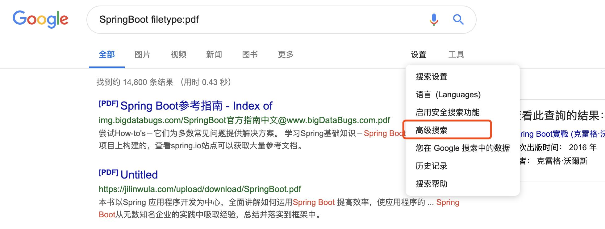
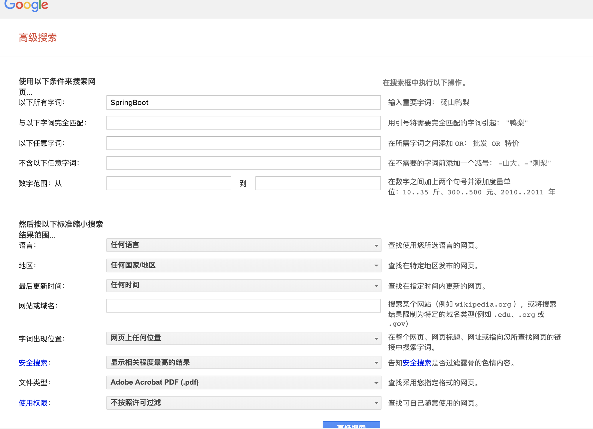
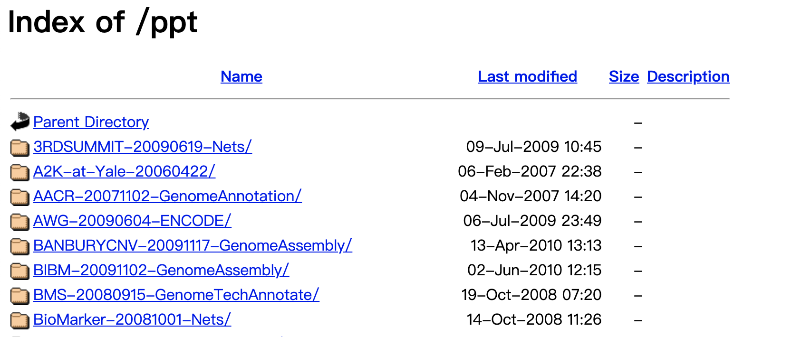

# Google的正确打开方式
# The Effective Way to Use Google

1. 在指定网站中搜索内容
    - 
    如：Spring site:www.github.com

2. 使用双引号来精确匹配（缩小搜索范围）
    -
    如："spring advantage"，不带双引号时搜索出的网页可能只包含spring或者只包含advantage，加上双引号之后会只列出同时含有spring和advantage两个关键词的网页

3. 排除特定搜索词的搜索结果
    -
    搜索格式：搜索词-需要被排除的词，如：北京大学 -百度百科

4. 包含特定搜索词
    -
    如：SpringBoot +redis

5. inurl在特定url链接中搜索
    -
    如：SpringBoot inurl:video (搜索结果中含有SpringBoot关键词且url中含有video)

6. intitle: 限定在网页标题title中搜索
    -
    如：SpringBoot intitle:阿里

7. filetype：在特定文档格式中搜索
    -
    如：SpringBoot filetype:pdf

8. 高级搜索
    -
    通过 https://www.google.com/advanced_search 直接进入或者通过下面入口进入：
    
    
    

9. 查找一些网络上的存档目录
    - "index of/" pdf
    - "index of/" inurl:lib

    

10. 其他sugar：
    - 抛硬币：搜索 flip a coin
    - 在线小游戏吃豆人：搜索 play pacman
    - 执行基本的算术运算，如搜索 1+2^10；搜索Calculator可以打开计算器
    - 快速调出词典，使用 define: xxx 的搜索格式，如 define: desperate

11. 其他参考：
    - [你真的会用Google吗？Google Hacking提升工作效率](https://www.jianshu.com/p/38a7829c2e8d)
    - [美国人教你这样用Google，你真的会变特工！！！](https://site.douban.com/120307/widget/notes/3700186/note/171975939/)